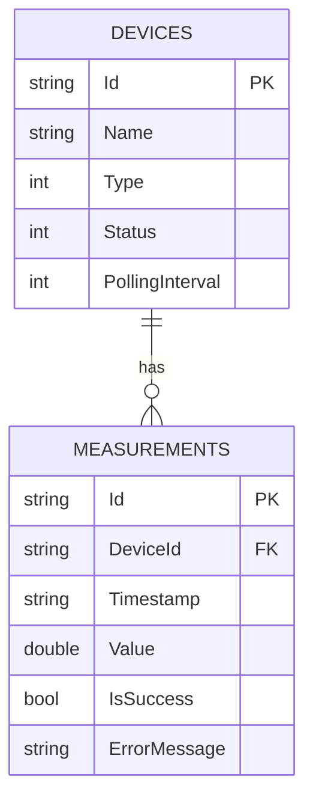

# Название проекта: DeviceMonitoringApp

## Назначение приложения
Device Monitoring App — настольное приложение, разработанное на языке C# с использованием WPF, предназначенное для мониторинга виртуальных измерительных устройств.

Приложение имитирует работу измерительных устройств различных типов, выполняет их асинхронный опрос, 
сохраняет результаты измерений в базе данных SQLite и предоставляет пользователю возможность просматривать текущее состояние устройств и историю полученных измерений.

<p align="center">
  <br>
  <b>Запуск программы</b>
</p>

<p align="center">
  <br>
  <b>Опрос начат</b>
</p>

<p align="center">
  <br>
  <b>Опрос остановлен</b>
</p>

<p align="center">
  <br>
  <b>Отображение истории измерений</b>
</p>

<p align="center">
  <br>
  <b>Данные истории измерений очищены</b>
</p>

## Используемые технологии
* **Язык программирования:** C#(.NET 10)
* **Фреймворк:** WPF(Windows Presentation Foundation)
* **База данных:** SQLlite
* **Доступ к базе данных:** Entity Framework Core
* **Тестирование:** MSTest

## Инструкция по сборке
1. Клонировать данный репозиторий
2. Открыть Visual studio или Rider
3. Открыть файл решения /src/DeviceMonitoringApp.sln
4. Дождаться автоматического восстановления NuGet-пакетов
5. Выбрать конфигурацию сборки Debug или Release
6. Собрать решение Build -> Build Solution

## Инструкция по запуску
1. Перейти в директорию /src/bin/Release/net10.0-windows или /src/bin/Debug/net10.0-windows
2. Найти и запустить файл DeviceMonitoringApp.exe

## Инструкция по запуску тестов
1. Открыть Viusal Studio или Rider
2. В Visual Studio открыть вкладку "Тесты" -> "Обозреватель тестов" (В Rider открыть вкладку "Unit Tests")
3. Нажать кнопку "Run all Test"(Запустить все тесты)

В тестах проверяется:
1. Запуск мониторинга
2. Изменение состояния устройств
3. Сохранение измерений
4. Обработка ошибок
5. Генерация события обновления устройства.

## Структура проекта
Исходный код приложения разделен на два основных проекта внутри общего решения DeviceMonitoringApp.sln
1. src/ (DeviceMonitoringApp) — основной проект WPF-приложения с бизнес-логикой и интерфейсом.
2. DeviceMonitoringTest/ — изолированный тестовый проект для автоматической проверки корректности работы модулей.
```text
DeviceMonitoringApp/
│
├── .gitignore                          # Настройки исключений Git (игнорирование bin/, obj/, *.db)
├── README.md                           # Главный файл документации проекта
│
├── DeviceMonitoringTest/               # Проект модульного тестирования (MSTest)
│   ├── DeviceMonitoringTest.csproj     # Конфигурационный файл тестового проекта
│   ├── MSTestSettings.cs               # Общие настройки окружения тестов
│   ├── FakeDeviceRepository.cs         # Mock-реализация IDeviceRepository для изоляции бизнес-логики от реальной БД
│   └── MonitoringServicesTest.cs       # Тестовые сценарии (проверка потоков, отмены задач и логирования ошибок)
│
└── src/                                # Корневая папка основного WPF-приложения
    ├── DeviceMonitoringApp.csproj      # Конфигурационный файл проекта (зависимости, NuGet-пакеты)
    ├── App.xaml / App.xaml.cs          # Точка входа в приложение. Содержит логику автоматического создания БД
    ├── AssemblyInfo.cs                 # Свойства и метаданные сборки приложения
    │
    ├── Data/                           # Слой доступа к данным (Data Access Layer)
    │   ├── AppDbContext.cs             # Контекст Entity Framework Core для маппинга моделей на таблицы SQLite
    │   ├── IDeviceRepository.cs        # Интерфейс репозитория для обеспечения слабой связанности (DI/IoC)
    │   └── DeviceRepository.cs         # Потокобезопасная реализация репозитория с использованием SemaphoreSlim
    │
    ├── Models/                         # Слой доменных моделей (Бизнес-сущности)
    │   ├── Device.cs                   # Модель измерительного устройства (реализует INotifyPropertyChanged для UI)
    │   ├── Measurement.cs              # Модель лога/записи измерения (связана отношением Many-to-One с Device)
    │   ├── DeviceType.cs               # Перечисление (Enum) доступных типов датчиков (Вольтметр, Амперметр и т.д.)
    │   └── DeviceStatus.cs             # Перечисление (Enum) текущих статусов работы (Online, Offline)
    │
    ├── Services/                       # Слой фоновых служб (Бизнес-логика)
    │   ├── IMonitoringService.cs       # Интерфейс фоновой службы мониторинга
    │   └── MonitoringService.cs        # Сервис асинхронного параллельного опроса приборов (Task.Run + CancellationToken)
    │
    ├── ViewModels/                     # Слой ViewModel (Паттерн MVVM)
    │   ├── ViewModelBase.cs            # Базовый класс с реализацией интерфейса INotifyPropertyChanged
    │   ├── RelayCommand.cs             # Универсальная реализация ICommand для привязки действий UI к методам
    │   └── MainViewModel.cs            # Главная ViewModel: координирует данные, обрабатывает команды кнопок и клики
    │
    └── Views/                          # Слой View (Пользовательский интерфейс)
        ├── MainWindow.xaml             # XAML-разметка главного окна (Layout, таблицы данных, стили кнопок)
        └── MainWindow.xaml.cs          # Code-behind главного окна. Чистый, содержит только вызов InitializeComponent()
```
## Описание базы данных
В качестве храния информации об устройствах и измерениях использовалась СУБД SQLlite. Взаимодействие с базой реализовано с использованием библиотеки Entity Framework Core
### Таблица Devices (Измерительные устройства)
| Имя столбца (Column) | Тип данных (SQLite) | C# свойство | Constraints (Ограничения) | Описание | Пример значения |
| :--- | :--- | :--- | :--- | :--- | :--- |
| **`Id`** | `TEXT` | `Guid` | PRIMARY KEY, NOT NULL | Уникальный глобальный идентификатор прибора. | `550e8400-e29b-41d4-a716-446655440000` |
| **`Name`** | `TEXT` | `string` | NOT NULL | Отображаемое название датчика в интерфейсе приложения. | `"Вольтметр"` |
| **`Type`** | `INTEGER` | `DeviceType` | NOT NULL | Тип прибора (числовой Enum):<br>• 0 — TemperatureSensor<br>• 1 — PressureSensor<br>• 2 — VoltageMeter<br>• 3 — CurrentMeter | `2` |
| **`Status`** | `INTEGER` | `DeviceStatus` | NOT NULL | Текущий статус подключения (числовой Enum):<br>• 0 — Offline<br>• 1 — Online | `1` |
| **`PollingInterval`** | `INTEGER` | `int` | NOT NULL | Интервал времени между запросами в миллисекундах

### Таблица Measurements (История логов и измерений)
| Имя столбца (Column) | Тип данных (SQLite) | C# свойство | Constraints (Ограничения) | Описание | Пример значения |
| :--- | :--- | :--- | :--- | :--- | :--- |
| **`Id`** | `TEXT` | `Guid` | PRIMARY KEY, NOT NULL | Уникальный идентификатор записи лога. | `3a2b4c5d-6e7f-8a9b-0c1d-2e3f4a5b6c7d` |
| **`DeviceId`** | `TEXT` | `Guid` | FOREIGN KEY, NOT NULL | Внешний ключ. Связывает запись с конкретным датчиком из таблицы Devices. | `550e8400-e29b-41d4-a716-446655440000` |
| **`Timestamp`** | `TEXT` | `DateTime` | NOT NULL | Точная дата и время фиксации измерения | `04:44:27` |
| **`Value`** | `REAL` | `double?` | NULLABLE | Сгенерированное числовое значение датчика. Принимает NULL, если IsSuccess = 0. | `31.5` |
| **`IsSuccess`** | `INTEGER` | `bool` | NOT NULL | Флаг успешности опроса <br>• 1(True) — Успешно<br> • 0(False) — Сбой | `1` |
| **`ErrorMessage`** | `TEXT` | `string?` | NOT NULL | Текст ошибки симулятора. Заполняется только при IsSuccess = 0, иначе хранит NULL | `Ошибка!` |

### Схема связей данных (ER-Diagram)

## Описание основных сценариев работы

### Сценарий 1
1. Название "Запуск программы мониторинга".
2. Основной поток: <br>
&nbsp;&nbsp;&nbsp;&nbsp;2.1. Пользователь запускает приложение `DeviceMonitoringApp.exe`.<br>
&nbsp;&nbsp;&nbsp;&nbsp;2.2. Система проверяет наличие таблиц в базе данных, в случае отсутствия таблиц система автоматически создаст таблицы `Devices` и `Measurements`.<br>
&nbsp;&nbsp;&nbsp;&nbsp;2.3. Система автоматически заполнит данными таблицу `Devices`.<br>
3. Предусловие: Приложение запускается впервые, база данных отсутствует.
4. Постусловие: Перед пользователем открывается главное окно. В левой таблице отображаются 4 устройства со статусом `Offline`.

### Сценарий 2
1. Название "Запуск опроса приборов"
2. Основной поток: <br>
&nbsp;&nbsp;&nbsp;&nbsp;2.1. Пользователь нажимает на кнопку **"Старт"**.<br>
&nbsp;&nbsp;&nbsp;&nbsp;2.2. Статусы приборов переключаются на **Online**.<br>
&nbsp;&nbsp;&nbsp;&nbsp;2.3. Опрошенные данные фиксируются в таблице `Measurements`. <br>
3. Предусловие: Устройства должны находится в режиме ожидания.
4. Постусловие: Пользователь при выборе устройства может увидеть в таблице `История измерений` с генерированные значения прибора в реальный момент времени.

### Сценарий 3
1. Название "Остановка мониторинга".
2. Основной поток: <br>
&nbsp;&nbsp;&nbsp;&nbsp;2.1. Пользователь нажимает на кнопку **"Стоп"**. <br>
&nbsp;&nbsp;&nbsp;&nbsp;2.2. Система перехватывает фоновые потоки и корректно завершает задачи. <br>
&nbsp;&nbsp;&nbsp;&nbsp;2.3. Система изменяет все статусы устройств на `Offline`. <br>
&nbsp;&nbsp;&nbsp;&nbsp;2.4. В столбце `Значение` записывается последнее сгенерированное значение устройства. <br>
3. Предусловие: Служба мониторинга активно опрашивает устройства в фоновых потоках. <br>
4. Постусловие: Пользователь выбрав определенное устройство может посмотреть всю историю записей. <br>


